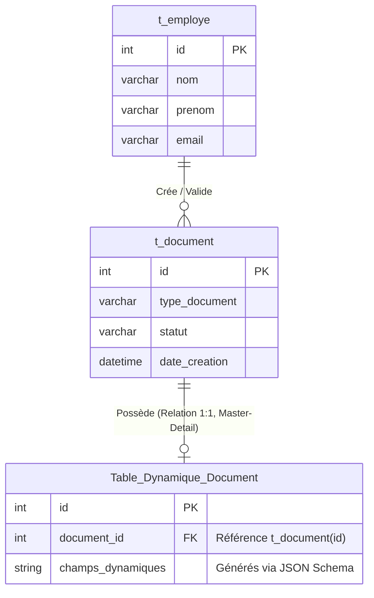

# Documentation Technique — Backend (Spring Boot)

Cette documentation détaille l'architecture du Backend Java/Spring Boot d'Edoc-Soummam. Elle couvre le modèle de données Master-Detail, la génération dynamique des requêtes SQL et l'exposition des endpoints REST, incluant la gestion avancée des erreurs et la consultation de données (Read-Only).

---

## 1. Vue d'Ensemble & Architecture Composants

Le Backend est responsable de la persistance dynamique des formulaires générés par le Frontend. Puisque la structure des formulaires (JSON Schemas) évolue dynamiquement, le Backend n'utilise **pas d'entités JPA statiques** pour le contenu métier, mais s'appuie sur `JdbcTemplate` pour exécuter des requêtes DDL (Data Definition) et DML (Data Manipulation) à la volée.

```mermaid
graph TD
    subgraph Couche Web [Controllers REST]
        FC[FormDataController<br/>/api/v1/form-data]
        FDC[FormDefinitionController<br/>/api/v1/definitions]
    end

    subgraph Couche Métier [Services]
        DS[DataService<br/>Orchestration & Validation]
        DefS[DefinitionService<br/>JSON -> DDL]
        
        FC --> DS
        FDC --> DefS
    end

    subgraph Couche Données [Repositories (JdbcTemplate)]
        DR[DataRepository<br/>DML: INSERT / SELECT]
        DefR[DefinitionRepository<br/>DDL: CREATE / ALTER]
        
        DS --> DR
        DefS --> DefR
    end

    subgraph Base de Données [MySQL]
        DR --> |Requêtes DML dynamiques| DB[(MySQL)]
        DefR --> |Requêtes DDL| DB
    end
```

---

## 2. Le Modèle de Données (Master-Detail)

Le système repose sur un modèle hybride : des tables systèmes fixes (`t_document`, `t_employe`) et des tables dynamiques correspondant à chaque type de formulaire (ex: `demande_conge`, `requisition`).



### Mécanisme de Sauvegarde (Transactionnel)
Lorsqu'un nouveau document est soumis via `/api/v1/form-data/{tableName}`, la méthode `insert` de `DataService` s'exécute dans un contexte transactionnel (`@Transactional`) :
1. **Insertion Maître** : Un enregistrement est inséré dans `t_document`. La base de données génère un identifiant auto-incrémenté.
2. **Récupération de la Clé** : L'ID généré est récupéré et injecté dans le payload reçu du Frontend sous la clé `document_id`.
3. **Insertion Détail (Dynamique)** : Le payload enrichi est inséré dans la table spécifique (ex: `demande_conge`) qui lie ainsi les données métiers au registre maître via la contrainte de clé étrangère `document_id`.

---

## 3. Sécurité et Génération Dynamique SQL

Puisque les noms de tables et de colonnes proviennent directement du Frontend (payload JSON), le Backend intègre de fortes sécurités pour prévenir les injections SQL et les conflits avec le moteur de base de données.

1. **Validation des Identifiants (`validateIdentifier`)** : 
   - Toute clé (nom de table, nom de colonne) est validée contre l'expression régulière stricte : `^[a-zA-Z_][a-zA-Z0-9_]*$`.
   - La clé est systématiquement forcée en minuscules (`.toLowerCase()`) pour garantir la compatibilité avec MySQL, ce qui impose une étape de normalisation en retour côté Frontend (via `pathToSchemaKey`).
2. **Échappement (Backticks)** : 
   - Dans le `DataRepository`, le constructeur de requêtes dynamiques entoure systématiquement chaque identifiant de colonne avec des backticks (`\``).
   - *Pourquoi ?* Cela évite les plantages SQL (ex: `Syntax Error`) si un utilisateur nomme un champ de son formulaire avec un mot clé réservé SQL (ex: `date`, `desc`, `order`).

---

## 4. Endpoints & Gestion Avancée des Erreurs

Le `FormDataController` expose les API REST appelées par le Frontend. L'accent a été mis sur la transparence des erreurs.

### A. Consultation de Ligne Unique (`findById`)
- **Route** : `GET /api/v1/form-data/{tableName}/{id}`
- **Fonctionnement** : Récupère la ligne précise correspondant à l'ID dans la table dynamique demandée.
- **Gestion des Erreurs** : Si la ligne n'existe pas, `JdbcTemplate` lève une `EmptyResultDataAccessException`. Le contrôleur l'intercepte et renvoie proprement un code HTTP `404 Not Found`.

### B. Insertion Dynamique (`insertData`)
- **Route** : `POST /api/v1/form-data/{tableName}`
- **Gestion des Erreurs Structurées** :
  - Si l'insertion échoue au niveau de la base de données (ex: une colonne manque car le schéma n'a pas été synchronisé), Spring lève une `DataAccessException`.
  - Au lieu de crasher silencieusement et de renvoyer une erreur générique `500 Internal Server Error`, le contrôleur intercepte cette exception.
  - Il la traduit en une `400 Bad Request` contenant un corps JSON structuré avec la propriété `details`.
  - Le Frontend lit cette propriété et affiche le message d'erreur exact (ex: `Unknown column 'date_fin' in 'field list'`), ce qui fluidifie énormément la phase de création/débogage des formulaires.
