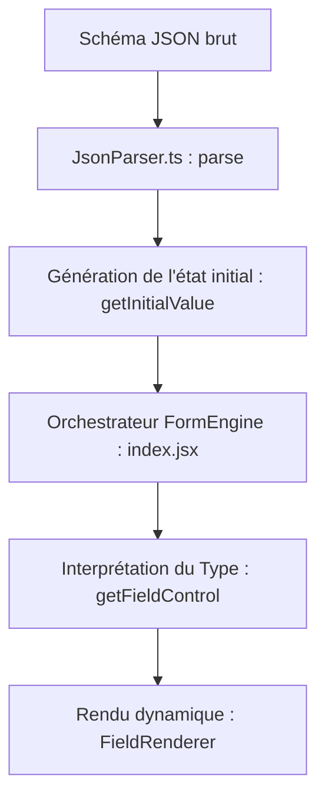

# Documentation Technique — Front-End & Form Engine (Edoc-Soummam)

Cette documentation présente l'architecture globale, la gestion des styles (CSS modulaire), le fonctionnement détaillé du moteur de formulaires dynamiques (Form Engine), les mécanismes de validation ainsi que les points clés d'extension et de modification du projet.

---

## 1. Architecture Globale du Front-End

L'application est structurée selon une approche **orientée fonctionnalités (features)** et **composants autonomes**. 
Elle s'articule principalement autour :
1. **Des Vues / Pages (`src/pages/`)** : Conteneurs de pages principaux (Dashboard, DocumentsList, CreateForm, ViewForm).
2. **Du Layout et de la Navigation (`src/components/`)** : Composants d'infrastructure (`Layout`, `Sidebar`, `TopNav`).
3. **Du Form Engine (`src/features/form-engine/`)** : Moteur de rendu et de validation dynamique basé sur le standard **JSON Schema**.
4. **Des Services d'API (`src/services/api.js`)** : Point de communication unique via Axios.

---

## 2. Système de Styles & Architecture CSS Modulaire

Le style de l'application a été récemment découpé pour abandonner le fichier monolithique `App.css` au profit d'une **architecture CSS par composant**. Chaque fichier CSS est importé au niveau de son composant ou de `App.jsx`.

### Structure des fichiers CSS
* **[`src/index.css`](file:///c:/Users/user/OneDrive/Bureau/Edoc-soummam/frontend/src/index.css)** : 
  * *Rôle* : Initialisation globale minimale (Reset CSS standard).
  * *Contenu* : Remise à zéro des marges du `body` et verrouillage du défilement (`overflow: hidden`) pour garantir un affichage plein écran.
* **[`src/components/Layout/Layout.css`](file:///c:/Users/user/OneDrive/Bureau/Edoc-soummam/frontend/src/components/Layout/Layout.css)** :
  * *Rôle* : Structure et squelette global de l'application (App Shell).
  * *Composants liés* : Conteneur global, barre principale flexible (`display: flex`), wrapper de navigation et de défilement du contenu principal.
* **[`src/components/Sidebar/Sidebar.css`](file:///c:/Users/user/OneDrive/Bureau/Edoc-soummam/frontend/src/components/Sidebar/Sidebar.css)** :
  * *Rôle* : Barre latérale de navigation.
  * *Styles* : Menu, logo, éléments de liste, états actifs (`.active`) et effets au survol (`:hover`).
* **[`src/components/TopNav/TopNav.css`](file:///c:/Users/user/OneDrive/Bureau/Edoc-soummam/frontend/src/components/TopNav/TopNav.css)** :
  * *Rôle* : Barre supérieure de l'application (Header).
  * *Styles* : Avatar utilisateur, boutons d'action avec effets de transition fluides, titre dynamique.
* **[`src/components/Dashboard/Dashboard.css`](file:///c:/Users/user/OneDrive/Bureau/Edoc-soummam/frontend/src/components/Dashboard/Dashboard.css)** :
  * *Rôle* : Bannière d'accueil ("Hero Panel") et grilles de cartes.
  * *Styles* : Dégradés HSL modernes, effet de flou (`backdrop-filter: blur`), grille adaptative `.cards-grid` (CSS Grid à 4 colonnes), cartes réactives `.document-card` avec ombres portées et micro-animations lors du survol.
* **[`src/components/FormRenderer/FormRenderer.css`](file:///c:/Users/user/OneDrive/Bureau/Edoc-soummam/frontend/src/components/FormRenderer/FormRenderer.css)** :
  * *Rôle* : Rendu visuel complet des formulaires et de ses éléments interactifs.
  * *Styles critiques* :
    * La grille `.form-grid` (Layout CSS Grid à 2 colonnes par défaut).
    * La gestion réactive de `.form-field.half-width` qui repasse en pleine largeur sur mobile (`@media (max-width: 600px)`).
    * Personnalisation ergonomique de l'icône de sélection de date (`input[type="date"]::-webkit-calendar-picker-indicator`) avec filtres CSS colorés et transitions.
    * États visuels des champs : erreur (`.input-error`), libellés (`.form-field-label`), astérisques de champs requis (`.form-field-required`).
* **[`src/components/Shared/EmployeeLookup.css`](file:///c:/Users/user/OneDrive/Bureau/Edoc-soummam/frontend/src/components/Shared/EmployeeLookup.css)** :
  * *Rôle* : Styles du module de recherche d'employés.
  * *Styles* : Spinner d'attente animé (`@keyframes spin`), badge de succès vert (`.employe-found-badge`), alignement du bouton de recherche.
* **[`src/components/Shared/Skeleton.css`](file:///c:/Users/user/OneDrive/Bureau/Edoc-soummam/frontend/src/components/Shared/Skeleton.css)** :
  * *Rôle* : Effets visuels de chargement.
  * *Styles* : Animation de balayage brillant (`@keyframes skeleton-shimmer`) appliquée sur les squelettes de texte, boutons et inputs.

---

## 3. Le Moteur de Formulaire Dynamique (Form Engine)

Le moteur génère dynamiquement des formulaires React interactifs à partir de définitions de schémas JSON standardisés.

### Flux de données et d'interprétation

### Modules et Rôles

#### 1. L'Orchestrateur : [`index.jsx`](file:///c:/Users/user/OneDrive/Bureau/Edoc-soummam/frontend/src/features/form-engine/form-renderer/index.jsx)
* Reçoit le schéma JSON (en chaîne de caractères ou objet) et un callback `onSubmit`.
* Gère l'état global du formulaire (`formData`), les erreurs de validation (`errors`) et l'état d'envoi (`isSubmitting`).
* Permet d'injecter des champs additionnels statiques ou requis par l'expérience métier (ex: le champ `"Numéro DOC"` lié à la clé `num_doc`).
* Prépare le `payload` en typant correctement les données (conversion en entier pour `integer`, réel pour `number` et booléen pour `boolean`) avant l'envoi.

#### 2. Le Parser : [`jsonParser.ts`](file:///c:/Users/user/OneDrive/Bureau/Edoc-soummam/frontend/src/features/form-engine/parser/jsonParser.ts)
* Valide la structure du fichier JSON schema (présence obligatoire de `properties`).
* Implémente la conversion du schéma JSON en payload MySQL (`toMysqlPayload`) pour automatiser la création des tables de base de données en fonction des champs du formulaire. Il mappe les types JSON aux types SQL (`DATE`, `VARCHAR`, `INTEGER`, etc.) en respectant les exigences `nullable` tirées du tableau `required`.

#### 3. Le Registre des Contrôles : [`register/index.js`](file:///c:/Users/user/OneDrive/Bureau/Edoc-soummam/frontend/src/features/form-engine/register/index.js)
* Détermine le composant HTML à utiliser en appliquant des règles ordonnées (Pattern de Chaîne de Responsabilité) :
  * Liste à choix multiple (`enum` / `oneOf`) $\rightarrow$ `<select>`
  * Format de date ou nom contenant "date" $\rightarrow$ `<input type="date">`
  * Booléen $\rightarrow$ `<input type="checkbox">`
  * Entier ou Décimal $\rightarrow$ `<input type="number">`
  * Texte long (`maxLength > 120`) $\rightarrow$ `<textarea>`
  * Autre $\rightarrow$ `<input type="text">` (standard)

#### 4. Le Moteur de Rendu : [`render.jsx`](file:///c:/Users/user/OneDrive/Bureau/Edoc-soummam/frontend/src/features/form-engine/form-renderer/render.jsx)
* **`FieldRenderer`** : Reçoit le type de contrôle déterminé par le registre et génère la structure HTML/React correspondante. Il intègre directement les attributs de validation (`minLength`, `maxLength`, `min` pour les dates, etc.).

---

## 4. Système de Validation & Évaluation des Expressions

La validation combine deux aspects : des règles basées sur le schéma et des validations inter-champs plus complexes.

### Validations des Champs : [`validator/index.js`](file:///c:/Users/user/OneDrive/Bureau/Edoc-soummam/frontend/src/features/form-engine/validator/index.js)
* **`validateField`** : Analyse unitaire d'une valeur.
  * Valide l'obligation de saisie (`isRequired`).
  * Valide les types numériques (`integer` : vérification que le nombre est entier).
  * Valide les longueurs minimales/maximales (`minLength` / `maxLength`).
  * Valide les expressions régulières (`pattern`).
* **`buildFormErrors`** : Construit la carte complète des erreurs de validation du formulaire.
  * Boucle sur tous les champs de la définition pour lever les erreurs.
  * Réalise des validations métier inter-champs, notamment en vérifiant que la date de début n'est pas postérieure à la date de fin :
    $$\text{dateDebut} \le \text{dateFin}$$

### Évaluateur d'Expressions Conditionnelles : [`expression-evaluator/index.js`](file:///c:/Users/user/OneDrive/Bureau/Edoc-soummam/frontend/src/features/form-engine/expression-evaluator/index.js)
* **`buildRequiredFields`** : Analyse dynamiquement les dépendances du formulaire via les structures standardisées `allOf / if / then`.
  * Si un champ du formulaire correspond à la condition définie dans le bloc `if` (ex: `natureDoc === 'CONTRAT'`), alors les champs spécifiés dans le bloc `then` de la règle (ex: `dateFin`) deviennent requis de manière dynamique à l'écran.

---

## 5. Guide de Modification et d'Extension

Voici où apporter vos modifications selon vos besoins de développement futurs :

### A. Ajouter un nouveau type d'input ou comportement graphique
1. **Modifier** [`register/index.js`](file:///c:/Users/user/OneDrive/Bureau/Edoc-soummam/frontend/src/features/form-engine/register/index.js) pour ajouter une règle de détection automatique dans la whitelist `FIELD_RULES`.
2. **Ajouter** le cas d'affichage correspondant dans le `switch` du composant `FieldRenderer` dans [`render.jsx`](file:///c:/Users/user/OneDrive/Bureau/Edoc-soummam/frontend/src/features/form-engine/form-renderer/render.jsx).
3. **Définir** ses styles spécifiques dans [`FormRenderer.css`](file:///c:/Users/user/OneDrive/Bureau/Edoc-soummam/frontend/src/components/FormRenderer/FormRenderer.css).

### B. Ajouter ou modifier des règles de validation
* **Validation d'un champ individuel** : Modifiez [`validateField` dans validator/index.js](file:///c:/Users/user/OneDrive/Bureau/Edoc-soummam/frontend/src/features/form-engine/validator/index.js#L15).
* **Règle inter-champs ou métier globale** : Ajoutez votre code de comparaison logique dans [`buildFormErrors` dans validator/index.js](file:///c:/Users/user/OneDrive/Bureau/Edoc-soummam/frontend/src/features/form-engine/validator/index.js#L74).

### C. Mettre à jour l'URI de l'API ou configurer les Endpoints
* Pour modifier les requêtes Axios et ajouter de nouveaux endpoints de base de données ou de recherche, éditez [`src/services/api.js`](file:///c:/Users/user/OneDrive/Bureau/Edoc-soummam/frontend/src/services/api.js).

### D. Ajuster la grille CSS (Layout)
* Pour modifier l'affichage adaptatif des formulaires ou passer en structure à 3 colonnes, ajustez la directive `grid-template-columns` dans la classe `.form-grid` dans [`FormRenderer.css`](file:///c:/Users/user/OneDrive/Bureau/Edoc-soummam/frontend/src/components/FormRenderer/FormRenderer.css#L35).
